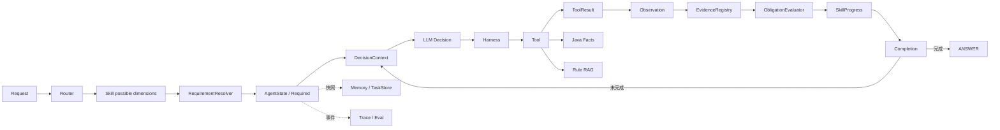

# 基于 Skill 编排与 Evidence Grounding 的拼团业务诊断 Agent

**Skill-Oriented Evidence-Grounded Business Diagnosis Agent**

`REFERENCE_ARCHITECTURE_VERSION = 1.1` · `STATUS = FROZEN`

> 本目录是 Architecture Reference：用于解释、复盘和指导重构，不是当前生产入口，也不会连接真实 LLM、Java、Redis 或向量库。

## 真实性分层

| 层 | 含义 | 本仓库中的代表内容 |
|---|---|---|
| A | 当前真实项目已经实现并经测试验证 | 单 Agent Loop、5 个只读 Tool、Java Facts、词法 RAG、SessionMemory、DiagnosisProgress、Evidence Guard、REQUEST_INPUT、HANDOFF、Trace、Eval |
| B | 从真实实现中提炼出的职责重构参考 | SkillSpec、RequirementResolver、Evidence Obligation、SkillRegistry、TaskRouter、TaskStore 接口及统一 HarnessRuntime |
| C | 生产化扩展设计，当前真实项目未实现 | Redis Checkpoint、长期记忆、Hybrid/Vector RAG、Rerank、MCP、A2A、多 Agent、写 Tool、熔断、正式 SLA |

## 为什么存在这个 Reference

真实项目已经跑通 LLM → Tool → Java/MySQL/RAG → Observation → Evidence → Answer，并完成多轮真实评测；早期实现为快速闭环，部分 Skill、Policy、Harness、Context 与任务恢复职责靠 Orchestrator 协调。本 Reference 在不改变核心语义的前提下，把这些职责拆成可读、可测、可面试讲解的对象，回答“谁决定、谁约束、谁保存、谁负责完成”。

## 一分钟架构

原则：模型处理不确定的动作选择与解释；确定性代码守住身份、能力、参数来源、证据、预算、重试和终止边界。它是动态 Agent Loop，不是固定 Tool Workflow。

## 完整示例：为什么参加不了活动 100123

1. Gateway 从认证层得到可信身份；用户只能提供问题文本。
2. Router 输出 `PARTICIPATION_DIAGNOSIS`、`activityId=100123`，只选择 Skill，不规划 Tool 顺序。
3. Participation Skill 声明 Possible 能力空间；RequirementResolver 为当前开放问题解析出 `activity_validity` 与 `user_eligibility` 两个 Required 维度。
4. ContextBuilder 只投影当前问题、Progress、相关 Observation、Evidence 与 Tool 描述，绝不暴露身份。
5. 模型可先选 Activity Facts，也可先选 Eligibility Facts。
6. Harness 验证 Tool 在能力白名单内、参数 Schema 合法、参数有用户/Observation 来源、身份未被模型注入、预算未超限。
7. Java Tool Stub 使用 RequestContext/AgentState 中的可信身份；Tool 参数里没有 userId。
8. 成功 ToolResult 经自身 Contract 校验后生成 Observation，再进入 EvidenceRegistry；Tool 成功本身不代表任务维度完成。
9. EvidenceObligationEvaluator 检查每个 Required Dimension 的全部 Condition，例如 activity.status 与 within_valid_time；缺一项仍为 PENDING。
10. 所有 Required Obligations SATISFIED 后 remaining 清空；Possible 中未被当前 Query 要求的规则维度不会强制 RAG。
11. ANSWER 必须引用存在于 Observation 的 Evidence 路径；EvidenceGuard 拒绝伪造引用。
12. 最终 State 保存结果，Trace 只记录安全事件和计数，不保存认证凭证或完整 Prompt。

两种合法顺序和完整结构化 Trace 见 `examples/01_参团失败诊断完整链路.md`。

## 模块责任速查

- Gateway：建立请求与可信身份边界。
- Router：识别任务并选择 Skill，不选择下一 Tool。
- Skill：声明能力、实体、Tool 范围、上下文、进度、完成与失败策略。
- AgentState：保存单个任务可恢复的完整工作状态。
- DecisionContext：AgentState 的最小模型可见投影。
- Orchestrator：推进有限状态循环，不复制 Guard 规则。
- HarnessRuntime：按顺序组合所有确定性 Guard 与 Retry/Timeout Policy。
- ToolRegistry / AgentTool：显式白名单与单次受限业务动作。
- ToolResult：表达执行成功或稳定失败；未抛异常不等于业务成功。
- Observation / Evidence：可信事实快照与答案可引用路径。
- ParameterProvenance：证明 Tool 参数从用户或 Observation 而来，与 Evidence 不同。
- Requirement / Evidence Obligation：分离 Skill 可能能力、本次必需维度与证据充分性。
- SkillProgress / Completion：由 Obligation 状态派生 satisfied/remaining，不规定调用顺序。
- Memory / TaskStore：恢复当前任务或隔离切题任务；不是长期用户画像。
- RAG：提供规则知识，不冒充实时业务事实。
- Trace / Eval：观测运行过程并分类失败，不参与业务推理。

## 当前真实项目能力与数据口径

真实项目拥有 5 个 Tool：Order Facts、Activity Facts、Eligibility Facts、Joinable Team Facts、Rule Search；接入 Java Facts、词法 RAG、SessionMemory、DiagnosisProgress、Evidence Guard、REQUEST_INPUT 与 HANDOFF。

| 指标 | 已验证结果 | 正确解释 |
|---|---:|---|
| Python 回归 | 192 passed | 当时版本自动测试通过，不等于生产 SLA |
| 最终 HTTP E2E | 23/23 | 指定验收场景全通过，不等于任意问题准确率 100% |
| Unsupported answer | 0 | 该批样本中无无证据回答 |
| Evidence failure | 0 | 该批 Evidence Contract 校验无失败 |
| Unnecessary tool | 0 | 该批未观察到无关 Tool 扩展 |
| Rule RAG Top-1 / Top-3 | 70% / 100% | 当前小型规则集的检索指标，不是回答准确率 |
| 开放诊断 | 17/20 FULL，0 PARTIAL | 其余为 Provider timeout → HANDOFF；不是总体准确率 85% |

详细样本、阶段和禁止误读见 `docs/22_项目指标与数据口径.md`。

## 明确未实现

长期记忆、Redis Checkpoint、多实例并发控制、Hybrid RAG、VectorDB、Rerank、MCP、A2A、多 Agent、带副作用写 Tool，以及正式 P95/QPS/SLA 均未在真实项目落地。本目录相关文件只属于 C 层生产化扩展设计，并在文件顶部明确标注。

## 15 步学习路线

1. `docs/00_阅读指南.md`：建立 A/B/C 真实性边界。
2. `docs/01_总体架构.md`：理解主循环与控制面。
3. `docs/02_真实项目映射.md`：逐对象对照真实项目。
4. `src/gateway/`、`src/routing/`：理解身份入口与任务选择。
5. `src/skills/`：理解 Skill 五件套与 Registry。
6. `src/agent/state.py`、`src/context/`：区分 State 与 Context。
7. `src/decision/`、`src/agent/orchestrator.py`：跟踪 Decision Loop。
8. `src/harness/`：理解确定性安全边界。
9. `src/tools/`：理解参数 Schema、可信身份与显式白名单。
10. `src/observations/`、`src/progress/`：理解 Evidence、Provenance 与完成语义。
11. `src/rag/`：区分规则知识与实时 Facts。
12. `src/memory/`：理解 Session 恢复、切题与隔离。
13. `src/eval/`、`src/observability/`：理解验收和故障分类。
14. `examples/`：按完整 Trace 反向验证对象协作。
15. `docs/16_面试连续追问索引.md`、`docs/21_项目连续拷打主线.md`：练习面试表达。

运行核验：`python architecture-reference/scripts/audit_reference.py`。

## Reference v1.1 单点修正

v1.0 的 Tool/Dimension-driven minimal Progress 已解决提前 ANSWER，但仍把 Tool 成功与
Dimension 完整性绑定得较强。v1.1 改为 Evidence-Obligation-Driven Progress：约束必须
获得哪些 Evidence，而不是必须调用哪些 Tool。真实项目 A 层仍是最小 DiagnosisProgress；
Possible/Required、RequirementResolver、Evidence Obligation 与 Evaluator 是 B 层
Architecture Reference Refactor，不能表述为真实线上已部署。
