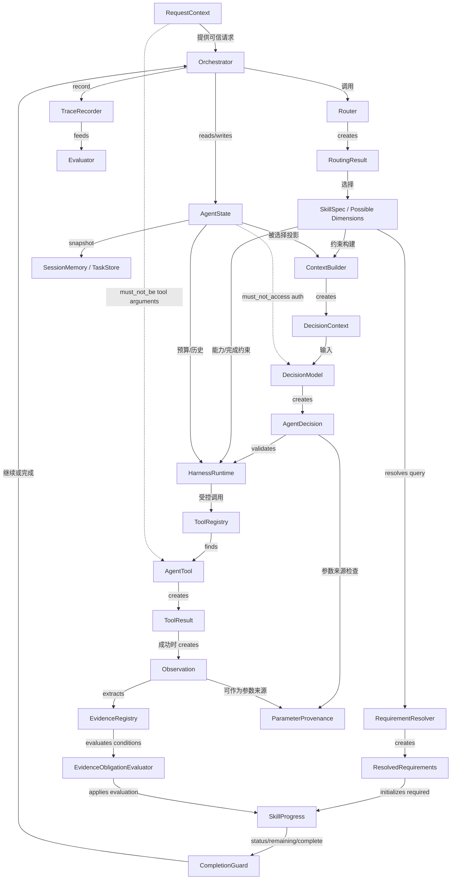
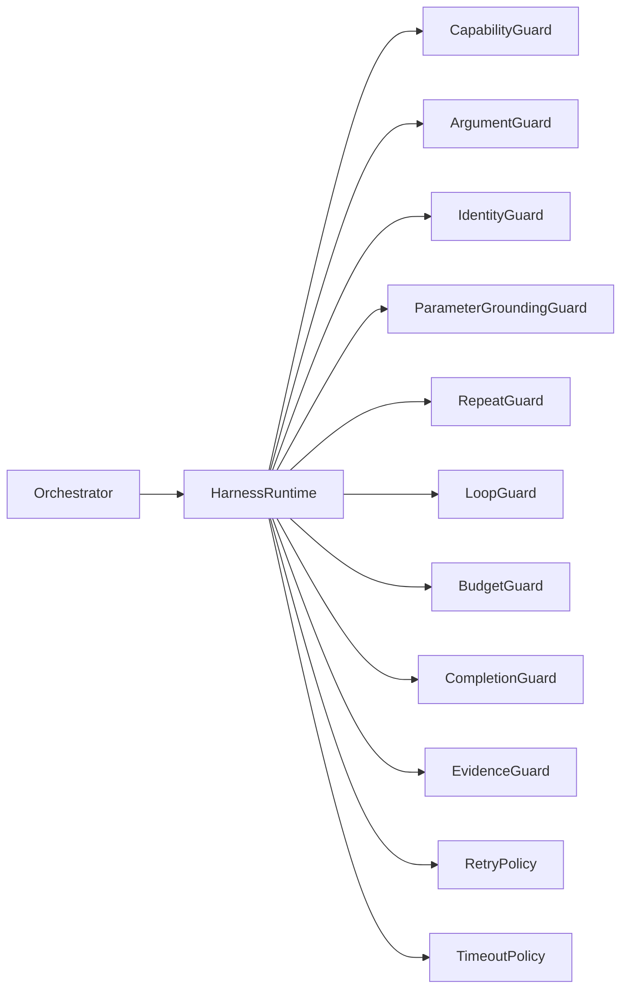

# 核心对象关系

## 最终对象图

虚线是安全边界：DecisionModel 不访问 authenticated identity；AgentTool 的模型参数不能包含身份。Java Client 只从 RequestContext/AgentState 的可信通道注入身份。

## 读写所有权

| 对象 | 主要创建者 | 可读者 | 可写者 | 不应承担 |
|---|---|---|---|---|
| RequestContext | Gateway | Orchestrator / Tool runtime | Gateway | 业务推理 |
| RoutingResult | Router | Orchestrator | 无（不可变） | Tool 规划 |
| SkillSpec | SkillRegistry | Router/Context/Harness | 注册阶段 | 把 Possible 当本次 Required |
| ResolvedRequirements | RequirementResolver | Skill/Progress | 无 | 访问身份、Trace、Tool 错误 |
| AgentState | Orchestrator | Context/Harness/Memory | Orchestrator 与受控方法 | 直接成为 Prompt |
| DecisionContext | ContextBuilder | DecisionModel | 无 | 保存身份和全部历史 |
| AgentDecision | DecisionModel | Validator/Harness | 无 | 绕过 Guard 执行 |
| ToolResult | AgentTool | Harness/Trace | 无 | 自动等价业务事实 |
| Observation | ObservationFactory | Context/Progress | 无 | 表示执行失败 |
| Evidence | EvidenceExtractor | Model/Harness/Eval | 无 | 证明 Tool 参数来源 |
| ParameterProvenance | Orchestrator | GroundingGuard | 无 | 支持最终答案 |
| EvidenceObligationEvaluator | Harness | Progress | 无状态 | 调用 LLM 或解释业务值 |
| SkillProgress | Skill | Context/Completion | State 应用评估 | 由 Tool dimension 人工推进 |

## 统一 Harness 链

Tool 前：Decision Contract → Capability → Argument → Identity → Parameter Grounding → Repeat → Loop/Budget → Execute。ANSWER 前：Completion → Evidence → Budget/Lifecycle。Tool failure 先分类 timeout/retryable，再交 RetryPolicy；耗尽后交 FailurePolicy/HANDOFF。

## 绝不等价

- State ≠ Context；Router ≠ Planner；Skill ≠ Tool；Skill ≠ SubAgent。
- ToolResult ≠ Observation；Evidence ≠ ParameterProvenance。
- Progress ≠ Workflow；Memory ≠ Trace。
- Possible ≠ Required ≠ Context Relevant；Tool success ≠ Dimension complete。

## v1.1 完成链

`possible_dimensions → RequirementResolver → required_dimensions → EvidenceObligationSpec
→ Observation/EvidenceRegistry → EvidenceObligationEvaluator → obligation_status
→ CompletionGuard`。Condition 可接受多个可信路径，所以完成约束不会退化成固定 Tool Workflow。

## WAITING_INPUT、切题与身份

REQUEST_INPUT 保存 `pending_user_query` 和合法 `missing_information`。同身份同 Session 的短补参恢复原任务；明确新 Intent 暂停旧任务并创建干净 State；新 Session 或不同身份不能继承。任何 `userId/token/header/sql` 都不是可请求字段。
